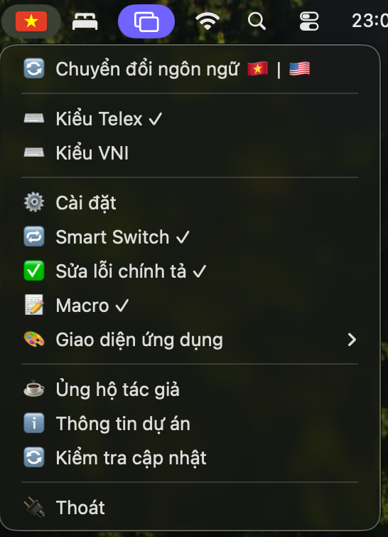
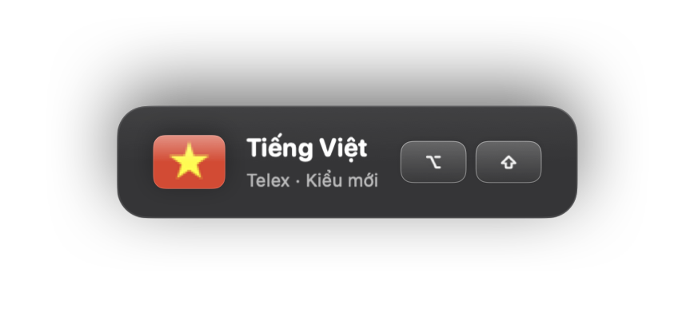
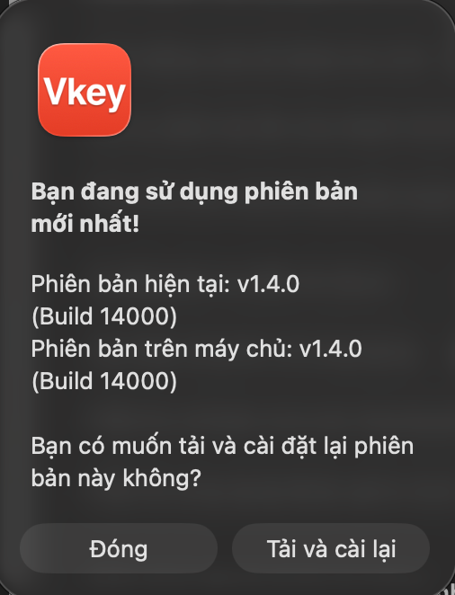
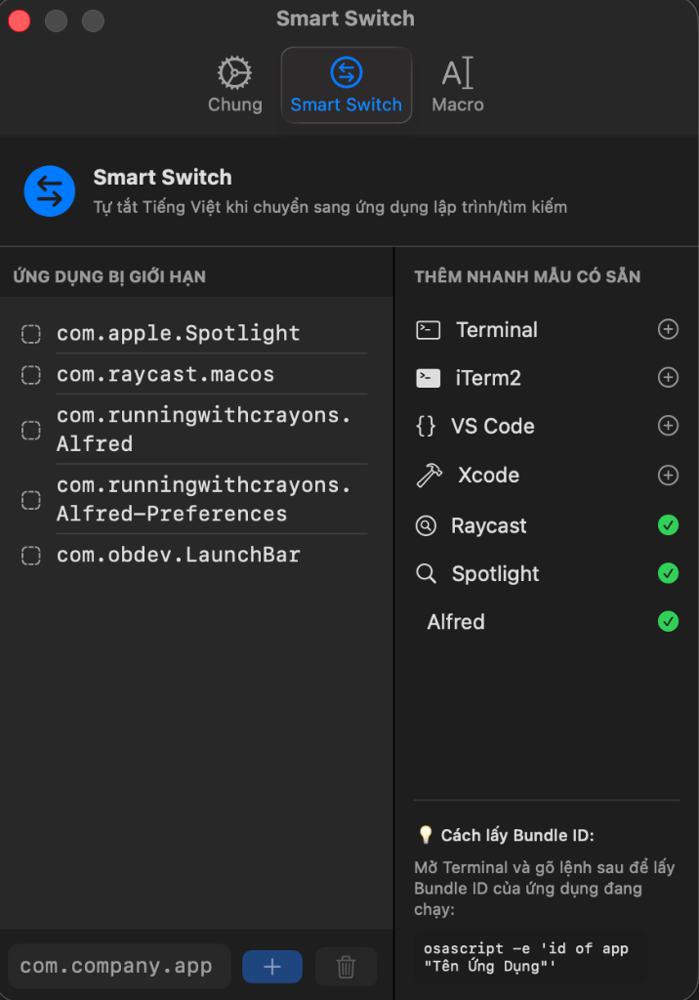
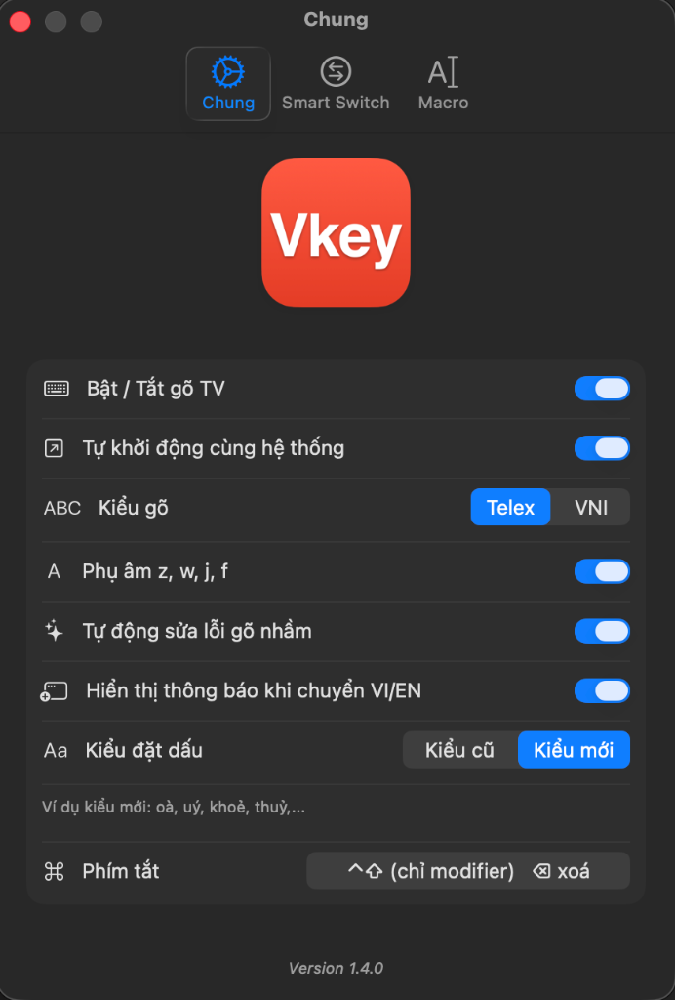
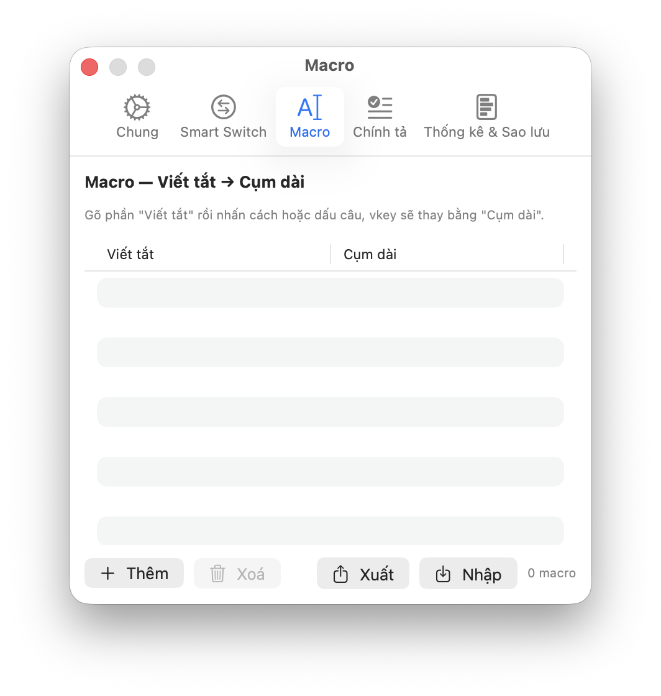
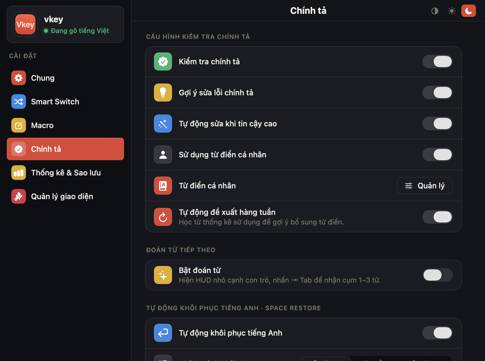
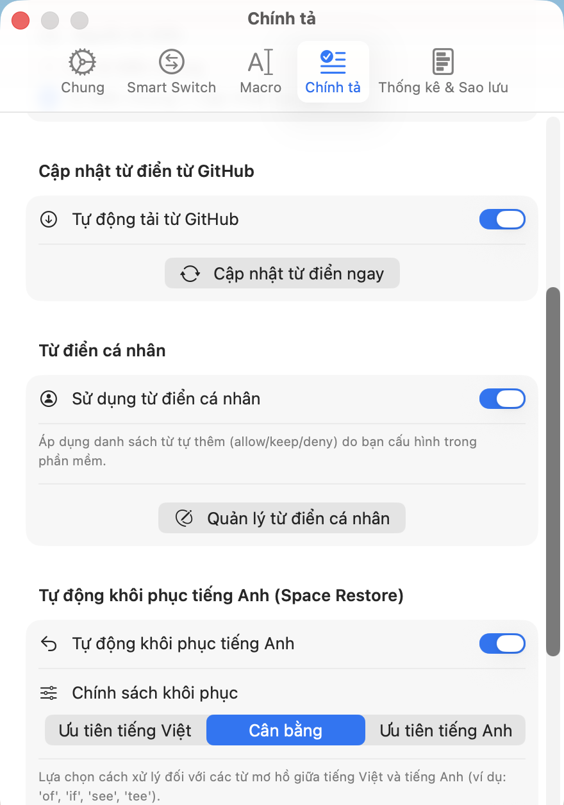
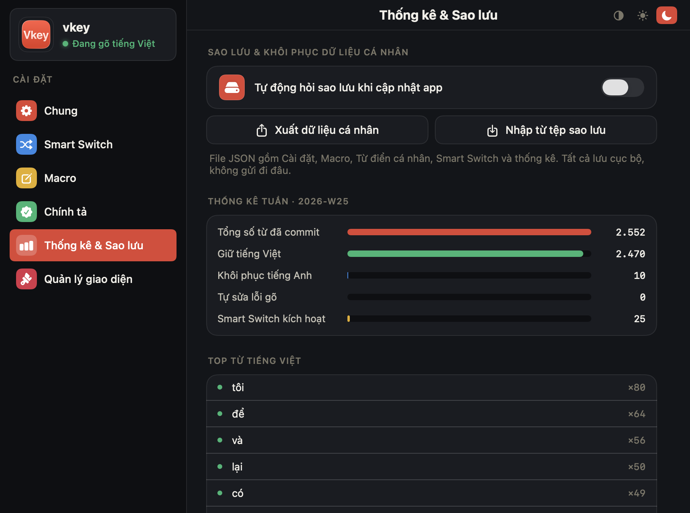
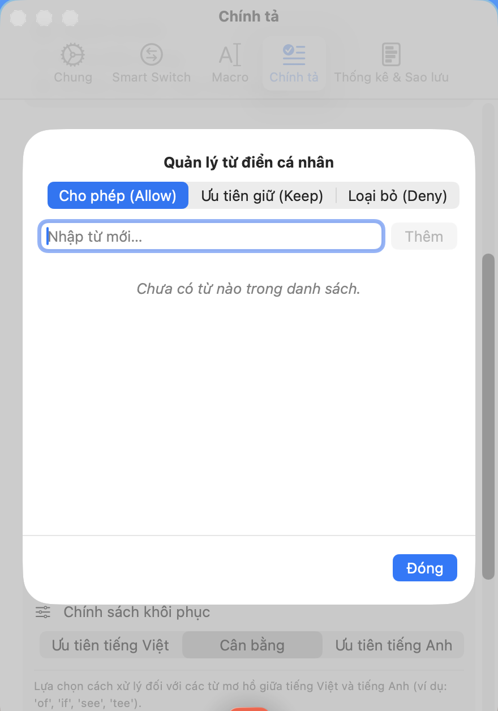

# vkey

Bộ gõ tiếng Việt cá nhân, đơn giản, cho macOS. Viết bằng Swift native, chạy như một app menu bar nhỏ gọn, hỗ trợ macOS 14 Sonoma trở lên.

**Phiên bản hiện tại: 1.5.4 — "Glossy Default"** ([CHANGELOG](CHANGELOG.md))


> **vkey là một bản fork mở rộng từ [Caffee](https://github.com/khanhicetea/Caffee)** của tác giả Khanh Nguyen ([@khanhicetea](https://github.com/khanhicetea)). Toàn bộ engine xử lý âm tiết tiếng Việt (Telex / VNI / Parser / Transformer / Validator) cùng kiến trúc Platform-Layer ban đầu đều do tác giả gốc xây dựng. 
> 
> Đồng thời, kể từ phiên bản v1.3.9, v1.4.0, v1.4.1, v1.4.2, v1.4.3, v1.4.4 và v1.4.5, vkey đã **học tập, cải tiến và tích hợp các ý tưởng thiết kế, giải pháp kỹ thuật xuất sắc từ dự án [XKey](https://github.com/xmannv/xkey)** của tác giả Xuan Manh Nguyen ([@xmannv](https://github.com/xmannv)) (bao gồm HUD mờ kính, AX Probing Smart Switch và bộ lọc phụ âm Impossible Clusters), kết hợp cùng **[GoNhanh.org](https://github.com/khaphanspace/gonhanh.org)** (thuật toán ma trận kiểm tra chính tả 6 bước, Vowel Inclusion Pairs, Space Restore, Escape Reversion và bảo toàn phím đúp), đồng thời tích hợp **bộ cơ sở dữ liệu từ điển 7.184 âm tiết tiếng Việt chuẩn từ dự án mã nguồn mở [common-vietnamese-syllables](https://github.com/vietnameselanguage/syllable) của tác giả Luông Hiếu Thi ([@hieuthi](https://github.com/hieuthi))** nhằm mang lại trải nghiệm người dùng tuyệt vời nhất. vkey kế thừa nguyên si và bổ sung thêm các tính năng riêng.

---

## Chức năng

- ✅ Gõ tiếng Việt với 2 kiểu phổ biến: **Telex** và **VNI**.
- ✅ Tuỳ chọn kiểu đặt dấu: **Kiểu mới** (thuỷ, khoẻ, hoà, uý) hoặc **Kiểu cũ** (thủy, khỏe, hòa, úy).
- ✅ **Tự động sửa lỗi gõ nhầm (Auto Typo Correction)**: Tự động sửa khi gõ nhầm dấu thanh sớm hoặc sai vị trí (ví dụ: `thfi` -> `thì`, `thfis` -> `thí`, `th2i` -> `thì`, `th1i` -> `thí`), sửa gạch chữ đ cuối từ (ví dụ: `dinhjd` -> `định` / `dinh59` -> `định`), sửa lỗi hoán đổi nguyên âm (ví dụ: `veeitj` -> `việt`) và hoán đổi phụ âm cuối (ví dụ: `phuowgn` -> `phương`). Có thể bật/tắt dễ dàng trong Cài đặt.
- ✅ Bộ gõ chỉ duy nhất Unicode (UTF-8), không hỗ trợ TCVN3/VNI Windows (giữ đơn giản).
- ✅ Nhớ chế độ Vi/En theo từng ứng dụng (per-app input mode memory).
- ✅ **Smart Switch & AX Probing**: Tự động tắt khi vào các bảng nhập liệu dạng Overlay/Launcher (Spotlight, Raycast, Alfred, LaunchBar) nhờ cơ chế AX Overlay Probing siêu nhẹ (<0.1ms) — giúp bạn gõ tìm kiếm tiếng Anh thuận tiện. Tự động khôi phục hoàn hảo trạng thái bộ gõ của ứng dụng nền trước đó khi đóng overlay lại. Có thể kích hoạt hoặc tắt nhanh từ thanh Menu Bar. Đồng thời, **tự động quét và phát hiện các ô nhập liệu đặc biệt** dạng dropdown và ô tìm kiếm (`AXComboBox`/`AXSearchField`) của toàn hệ thống để kích hoạt chế độ Overwrite chọn-thay-thế, chống dính chữ triệt để.
- ✅ **Kiểm tra Chính tả 6 bước & Vowel Inclusion Pairs (từ GoNhanh.org)**: Triệt để ngăn chặn gõ dấu sai cấu trúc âm tiết tiếng Việt. Bộ whitelisting các cặp nguyên âm có thể đi cùng nhau loại bỏ triệt để hiện tượng tự động sửa nhầm trên các từ tiếng Anh (như `claus`, `metric`, `house`, `beyond`). Hỗ trợ gõ phụ âm đầu ghép `kr` (như trong *Krông Ana*) và phụ âm cuối `k` (như trong *Đắk Lắk*).
- ✅ **Bảo toàn Phím đúp (Doubled Tone Mark Preservation)**: Giữ nguyên phím đúp liên tiếp (`ss`, `ff`, `rr`, `xx`, `jj`) thay vì tự động xoá/toggle, bảo vệ hoàn toàn các từ tiếng Anh thông dụng như `staff`, `off`, `class`, `pass`, `staff`.
- ✅ **Tự động Khôi phục từ Tiếng Anh (Space Restore)**: Tự động phát hiện và khôi phục các ký tự tiếng Anh bị gõ nhầm khi nhấn phím Space (như `ò` -> `of`, `ì` -> `if`, `sê` -> `see`, `tê` -> `tee`).
- ✅ **Phục hồi Nhanh phím ESC (Escape Reversion)**: Nhấn ESC để hoàn tác ngay lập tức từ đang gõ dở dang về dạng phím thô ban đầu và đặt lại bộ đệm.
- ✅ **Hiển thị thông báo trực quan (Translucent Toggle HUD)**: Cửa sổ thông báo mờ kính (Glassmorphic HUD) hiển thị giữa màn hình khi chuyển đổi chế độ gõ (VI/EN) qua phím tắt, giúp nhận biết trạng thái gõ tức thời mà không cần nhìn lên Menu Bar. Tự động thông minh bỏ qua khi khởi động và Smart Switch.
- ✅ **Macro** (viết tắt → cụm dài): gõ `vn ` → ra `Việt Nam `.
- ✅ Phím tắt linh hoạt: hỗ trợ cả tổ hợp key+modifier (vd `⌃⇧Z`) và **modifier-only** (vd nhấn-thả `⌃⇧` để toggle).
- ✅ Fix lỗi thanh địa chỉ trình duyệt + Excel autocomplete.
- ✅ Tương thích Electron / web app (Notion, Slack, Discord…): mặc định dùng **hybrid sending strategy** (backspace delay 800µs) đợi vòng composition. Một số app có per-app override sẵn để chạy ổn định nhất: Claude desktop + terminals (Terminal, iTerm2, Kitty, Ghostty, Warp, Hyper, Tabby, Alacritty) dùng `stepByStep`; Microsoft Office (Word, Excel, PowerPoint, Outlook, OneNote) dùng `hybrid` với backspace delay 1000µs.
- ✅ Tự bypass khi macOS bật secure input (gõ password an toàn).
- ✅ Khởi động cùng macOS (tuỳ chọn).
- ✅ Hoạt động xuyên QWERTZ / AZERTY / Dvorak (dùng physical key code → mapping QWERTY position cho Telex/VNI).
- ✅ **Cập nhật trực tiếp (Sparkle Integration)**: Tải và cài đặt trực tiếp bản cập nhật mới nhanh gọn, an toàn.
- ✅ **Thống kê sử dụng & tự học hành vi (mới ở v1.5.0)**: Theo dõi cục bộ (không gửi đi đâu) các từ bạn gõ nhiều nhất trong tuần. Mỗi tuần, các từ tiếng Anh được khôi phục ≥5 lần tự động được thêm vào danh sách `Allow` để lần sau bộ gõ nhận diện nhanh hơn; các từ tiếng Việt được giữ nguyên ≥5 lần được thêm vào danh sách `Keep` để không bao giờ bị auto-restore nhầm sang tiếng Anh. Có thể tắt hoàn toàn hoặc xóa dữ liệu trong tab "Thống kê & Sao lưu".
- ✅ **Sao lưu & khôi phục dữ liệu cá nhân (mới ở v1.5.0)**: Xuất / nhập JSON gồm toàn bộ Cài đặt, Macro, từ điển cá nhân, Smart Switch, per-app override, thống kê. Khi cập nhật phiên bản, app tự động hỏi sao lưu trước khi tiếp tục.
- ✅ **Từ điển tham chiếu Anh-Việt (mới ở v1.5.0)**: 110 cặp từ song ngữ giúp bộ gõ phân biệt tiếng Anh / tiếng Việt chính xác hơn. Nguồn: Wiktionary (CC BY-SA 4.0) — xem [LICENSE-DATA.md](LICENSE-DATA.md).
- ✅ Hỗ trợ **Ủng hộ tác giả** (Donate) qua VietQR.

## Hình ảnh giao diện

### Thao tác nhanh & HUD

<p align="center">
  
  
  
</p>

### Các tab Cài đặt

<p align="center">
  
  
  
</p>

<p align="center">
  
  
  
</p>

<p align="center">
  
</p>

## Cài đặt

### Tải file DMG (đơn giản nhất)

1. Tải `vkey-x.y.z.dmg` từ trang [Releases](../../releases/latest).
2. Mở DMG → kéo `vkey` vào thư mục `Applications`.
3. Vì vkey chỉ ký ad-hoc (không có Apple Developer ID), khi mở lần đầu macOS chặn:
   - Mở Finder → Applications → **click chuột phải vào vkey** → chọn **"Mở"**.
   - Hộp thoại hiện ra → bấm **"Mở"** xác nhận.
   - Chỉ cần làm 1 lần.
4. Vào **System Settings → Privacy & Security → Accessibility** → bật toggle cho `vkey`.
5. Tắt rồi mở lại app để event tap được nạp.

### Build từ source

Yêu cầu: macOS 14+ (Sonoma), Xcode 15.3+ (Swift 5.10+).

```bash
git clone https://github.com/tuanlongsav/vkey.git
cd vkey
xcodebuild -project vkey.xcodeproj -scheme vkey \
  -configuration Release \
  -derivedDataPath /tmp/vkey-release \
  CODE_SIGN_IDENTITY="-" CODE_SIGNING_REQUIRED=NO \
  clean build
ditto /tmp/vkey-release/Build/Products/Release/vkey.app /Applications/vkey.app
```

## Sử dụng

### Thao tác nhanh trên Menu Bar

Click icon cờ trên menu bar để mở các tác vụ nhanh.

| Tác vụ | Cách dùng |
|--------|----------|
| Chuyển VN ↔ EN bằng phím tắt | Nhấn + nhả **⌃⇧** (Control + Shift) đồng thời (mặc định) |
| Chuyển VN ↔ EN từ menu | Menu → **"Chuyển đổi bộ gõ 🇻🇳 \| 🇺🇸"** |
| Đổi kiểu gõ | Menu → **"Kiểu Telex"** / **"Kiểu VNI"** (✓ ở dòng đang chọn) |
| Bật/tắt nhanh Smart Switch | Menu → **"Smart Switch"** (✓ khi đang bật) |
| Bật/tắt nhanh Sửa lỗi chính tả | Menu → **"Sửa lỗi chính tả"** (✓ khi đang bật) |
| Bật/tắt nhanh Macro (mới 1.5.3) | Menu → **"Macro"** (✓ khi đang bật) — tạm dừng expansion mà vẫn giữ danh sách |
| Mở cửa sổ Cài đặt | Menu → **"Cài đặt"** |
| Ủng hộ tác giả | Menu → **"Ủng hộ tác giả"** (quét mã VietQR) |
| Trang dự án trên GitHub | Menu → **"Thông tin dự án"** |
| Kiểm tra cập nhật thủ công | Menu → **"Kiểm tra cập nhật"** |
| Thoát vkey | Menu → **"Thoát"** |

**Trạng thái icon menu bar:**
- 🇻🇳 cờ Việt Nam: đang gõ tiếng Việt
- 🇺🇸 cờ Mỹ: đang gõ tiếng Anh
- 🔒 ổ khoá: đang ở ô password (vkey tự bypass)
- ⚙️ bánh răng có dấu hỏi: chưa cấp quyền Accessibility

### Cài đặt → tab **Chung**

| Mục | Tác dụng |
|-----|---------|
| Bật / Tắt gõ TV | Toggle tổng — bật để gõ tiếng Việt, tắt để gõ thẳng tiếng Anh |
| Tự khởi động cùng hệ thống | Đăng ký vkey vào Login Items macOS |
| Kiểu gõ | Telex / VNI (segmented) |
| Phụ âm `z`, `w`, `j`, `f` | Cho phép coi chúng là phụ âm hợp lệ khi parse âm tiết |
| Tự động sửa lỗi gõ nhầm | Bật/tắt Auto Typo Correction (`thfi → thì`, `dinhjd → định`, `veeitj → việt`, `phuowgn → phương` …) |
| Hiển thị thông báo khi chuyển VI/EN | Bật/tắt Glassmorphic Toggle HUD ở giữa màn hình |
| Kiểu đặt dấu | **Kiểu mới** (thuỷ, khoẻ, hoà, uý) ⟷ **Kiểu cũ** (thủy, khỏe, hòa, úy) |
| Phím tắt | Bấm vào nút → nhập tổ hợp (`⌃⇧Z`) hoặc nhấn-thả modifier (`⌃⇧`) để dùng modifier-only. Backspace để xoá phím tắt, Esc để huỷ |

### Cài đặt → tab **Smart Switch**

| Tác vụ | Cách dùng |
|--------|----------|
| Bật/tắt Smart Switch | Toggle ở đầu tab (hoặc nút nhanh ngoài menu bar) |
| Thêm ứng dụng "luôn dùng tiếng Anh" | Nhập Bundle ID rồi bấm **"Thêm"** (có sẵn các mẫu phổ biến: Xcode, VSCode, Terminal…) |
| Lấy Bundle ID của app đang chạy | Mở Terminal, gõ `osascript -e 'id of app "Tên Ứng Dụng"'` |
| Xoá app khỏi danh sách | Chọn dòng → bấm **🗑** |

### Cài đặt → tab **Macro**

| Tác vụ | Cách dùng |
|--------|----------|
| Bật/Tắt Macro (mới 1.5.3) | Toggle đầu tab (hoặc nút nhanh trên menu bar) — khi tắt, danh sách vẫn giữ nhưng macro tạm dừng |
| Thêm macro mới | Bấm **"Thêm"** → điền cột "Viết tắt" và "Cụm dài" |
| Xoá macro | Chọn dòng → bấm **"Xoá"** |
| Xuất macro ra JSON | Bấm **"Xuất"** — lưu file JSON để chia sẻ giữa máy |
| Nhập macro từ JSON | Bấm **"Nhập"** — gộp vào danh sách hiện tại, bỏ qua trùng |
| Kích hoạt khi gõ | Gõ phần "Viết tắt" rồi nhấn **Space** hoặc **dấu câu**, vkey thay bằng "Cụm dài" |
| Macro mặc định (mới 1.5.3) | Lần đầu mở app sau cập nhật: 19 macro văn phòng VN có sẵn (`vn`, `tv`, `kg` (Kính gửi), `bcao`, `cty`, `gd`, `sdt`, …). Tự xoá / sửa thoải mái. |

### Cài đặt → tab **Chính tả**

Tab này được **tinh gọn lại ở 1.5.3** — bỏ Picker "Nguồn từ điển" + Toggle "Tự động tải từ GitHub" (đều luôn-on), đưa "Gợi ý & Sửa lỗi chính tả" lên cạnh "Kiểm tra chính tả". Thứ tự section mới: Master → Kiểm tra → Gợi ý → Space Restore → Từ điển cá nhân → Từ điển GitHub.

| Mục | Tác dụng |
|-----|---------|
| Kích hoạt nhanh tất cả tính năng mới | Toggle gộp — bật/tắt cùng lúc mọi tính năng chính tả + từ điển bên dưới |
| Kiểm tra chính tả | Bật cơ chế 6-bước check + Vowel Inclusion Pairs (chặn gõ dấu sai cấu trúc âm tiết) |
| Kiểm tra trong câu | Mở rộng kiểm tra cho từ ở giữa câu (không chỉ từ vừa gõ) |
| Gợi ý sửa lỗi chính tả | Hiện gợi ý khi gõ sai (Levenshtein + heuristic). Đứng ngay sau Kiểm tra (mới 1.5.3) |
| Tự động sửa khi tin cậy cao | Áp dụng gợi ý luôn nếu độ tin cậy ≥ 88% |
| Tự động khôi phục tiếng Anh | Bật Space Restore (`ò → of`, `ì → if`, `sê → see`, `tê → tee`…) |
| Chính sách khôi phục | **Ưu tiên tiếng Việt** / **Cân bằng** / **Ưu tiên tiếng Anh** cho từ mơ hồ |
| Dùng từ điển tham chiếu Anh-Việt | Bật 110 cặp song ngữ từ Wiktionary (mới ở 1.5.0) |
| Sử dụng từ điển cá nhân | Bật danh sách Allow / Keep / Deny do bạn tự định nghĩa |
| Quản lý từ điển cá nhân | Mở editor → thêm / xoá từ trong 3 danh sách Allow / Keep / Deny |
| Từ điển GitHub — Cập nhật ngay | Bấm để force-download bản mới nhất từ GitHub. Bình thường app tự tải im lặng mỗi 24h khi launch (mới 1.5.3) |

### Cài đặt → tab **Thống kê & Sao lưu**

| Mục | Tác dụng |
|-----|---------|
| Ghi nhận thống kê sử dụng | Bật/tắt log cục bộ (`~/Library/Application Support/vkey/stats/`) |
| Chạy đồng bộ Personal Dictionary ngay | Promote thủ công các từ ≥5 lần trong tuần vào Allow/Keep |
| Xóa toàn bộ dữ liệu thống kê | Reset cả tuần này lẫn các tuần đã đóng |
| Tự động hỏi sao lưu khi cập nhật app | Hiện prompt xuất JSON trước khi app chạy phiên bản mới |
| Xuất dữ liệu cá nhân | Lưu JSON gồm Cài đặt + Macro + từ điển cá nhân + Smart Switch + per-app + thống kê |
| Nhập từ tệp sao lưu | Chọn **"Gộp"** (giữ dữ liệu hiện tại) hoặc **"Ghi đè toàn bộ"** |

### Phím gõ đặc biệt khi đang gõ

| Phím | Tác dụng |
|------|---------|
| **Space** sau từ tiếng Anh bị gõ nhầm | Tự khôi phục về tiếng Anh (Space Restore) |
| **Esc** giữa chừng | Hoàn tác về phím thô ban đầu, reset bộ đệm |
| Gõ đúp `ss`, `ff`, `rr`, `xx`, `jj` | Giữ nguyên đúp (không bị toggle dấu) — cho từ tiếng Anh như `staff`, `off`, `class`, `pass` |
| Click chuột vào ô khác giữa từ | Reset bộ đệm sạch sẽ — không dính chữ qua ô khác |

## FAQ

**1. Có an toàn không?**
Mã nguồn mở GPL v3, bạn tự build hoặc đọc code trước khi tin. App không gửi dữ liệu đi đâu, không telemetry.

**2. Tại sao phải cấp quyền Accessibility?**
vkey nghe keyboard system-wide (qua `CGEvent.tapCreate`) để chuyển ký tự bạn gõ thành tiếng Việt. Đây là quyền chuẩn cho mọi bộ gõ "hàng chế" trên macOS (OpenKey, EVKey, GoTiengViet cũng vậy). Apple's official IME thì dùng cơ chế khác (Input Method Kit) nhưng có nhược điểm gạch chân + bug khi click sang ô khác giữa từ.

**3. Sao chỉ nhận Telex và VNI?**
Triết lý "đơn giản nhất". Hai kiểu này phủ ~95% người dùng VN. Không có bảng setting to đùng như OpenKey/EVKey.

**4. Bản DMG có notarized không?**
Không. Đây là dự án cá nhân, không có Apple Developer ID. Bạn tin tưởng → right-click Open. Không tin → build lại từ source.

## Giấy phép & Bản quyền

vkey kế thừa giấy phép **GNU General Public License v3.0** từ Caffee. Xem file [`LICENSE`](LICENSE).

Điều này có nghĩa:
- Bạn **được** sao chép, sửa, phân phối lại.
- Bản phân phối lại của bạn **bắt buộc** cũng phải mở mã nguồn dưới GPL v3 (copyleft).
- Không được phép đóng nguồn và bán thương mại độc quyền.

### Ghi công (Credit & Attribution)

vkey là một sản phẩm nguồn mở phát triển vì cộng đồng, kế thừa và học hỏi các giải pháp xuất sắc từ các tác giả đi trước:
- **[Caffee](https://github.com/khanhicetea/Caffee)** © Khanh Nguyen ([@khanhicetea](https://github.com/khanhicetea)) — Đóng góp toàn bộ engine xử lý tiếng Việt ban đầu + kiến trúc lõi của bộ gõ.
- **[XKey](https://github.com/xmannv/xkey)** © Xuan Manh Nguyen ([@xmannv](https://github.com/xmannv)) — Đóng góp các ý tưởng sáng tạo và giải pháp kỹ thuật xuất sắc bao gồm giao diện mờ kính **Translucent Toggle HUD**, giải pháp AX Probing Smart Switch và bộ lọc phụ âm **Impossible Consonant Clusters**.
- **[GoNhanh.org](https://github.com/khaphanspace/gonhanh.org)** © Phan Anh Kha ([@khaphanspace](https://github.com/khaphanspace)) — Đóng góp thuật toán kiểm tra chính tả 6 bước, ma trận Vowel Inclusion Pairs, Space Restore, Escape Reversion và Doubled Tone Mark Preservation xuất sắc giúp hoàn thiện tối đa trải nghiệm gõ song ngữ Anh-Việt.
- **vkey** © 2026 longht ([@tuanlongsav](https://github.com/tuanlongsav)) — các tính năng mở rộng và hoàn thiện hệ thống.

Mỗi file source vẫn giữ header gốc của tác giả Caffee khi có. Vui lòng tôn trọng attribution khi tiếp tục fork.

### Nguồn dữ liệu từ điển (bổ sung từ v1.5.0)

vkey 1.5.0 tích hợp dữ liệu từ điển song ngữ Anh-Việt từ các nguồn mở sau, tuân thủ đầy đủ điều khoản license của từng nguồn:

- **[common-vietnamese-syllables](https://github.com/vietnameselanguage/syllable)** © Luông Hiếu Thi ([@hieuthi](https://github.com/hieuthi)) — 7.184 âm tiết tiếng Việt chuẩn (`vietnamese[]`).
- **English Wiktionary** qua **[Wiktextract](https://github.com/tatuylonen/wiktextract)** + **[Kaikki.org](https://kaikki.org)** — Dữ liệu cặp từ Anh↔Việt (`en_vn_mapping`). Phân phối lại theo **CC BY-SA 4.0**.
- **[wordfreq](https://github.com/rspeer/wordfreq)** © Robyn Speer — Bảng tần suất từ tiếng Anh để chọn lọc `english[]`. MIT license cho tool, CC BY-SA 4.0 cho phần data nguồn Wiktionary.

Dữ liệu phái sinh nằm trong `lexicon/lexicon-update.json` và được phát hành lại theo **CC BY-SA 4.0** (data) song song với **GPL-3.0** (code). Xem chi tiết tại [`LICENSE-DATA.md`](LICENSE-DATA.md).

Quy trình build lexicon: `Tools/build_lexicon.py` (yêu cầu `pip install wordfreq requests`).

### Lưu ý về tên gọi

Tên "vkey" được chọn ngắn gọn, **không liên quan** đến các sản phẩm thương mại / dịch vụ đã đăng ký bảo hộ tại Việt Nam (vd các sản phẩm chữ ký số / bảo mật có chữ "VKey"). Đây là phần mềm phi thương mại, không thay thế / cạnh tranh với sản phẩm đăng ký thương hiệu nào.

### Engine xử lý tiếng Việt

vkey **không** sử dụng mã nguồn từ UniKey (Phạm Kim Long), EVKey hay OpenKey. Engine `Engine/TiengViet*.swift` là của Caffee, được viết lại độc lập từ đầu bằng Swift theo lý thuyết âm tiết học tiếng Việt — xem chi tiết trong [app-arch.md](app-arch.md).
