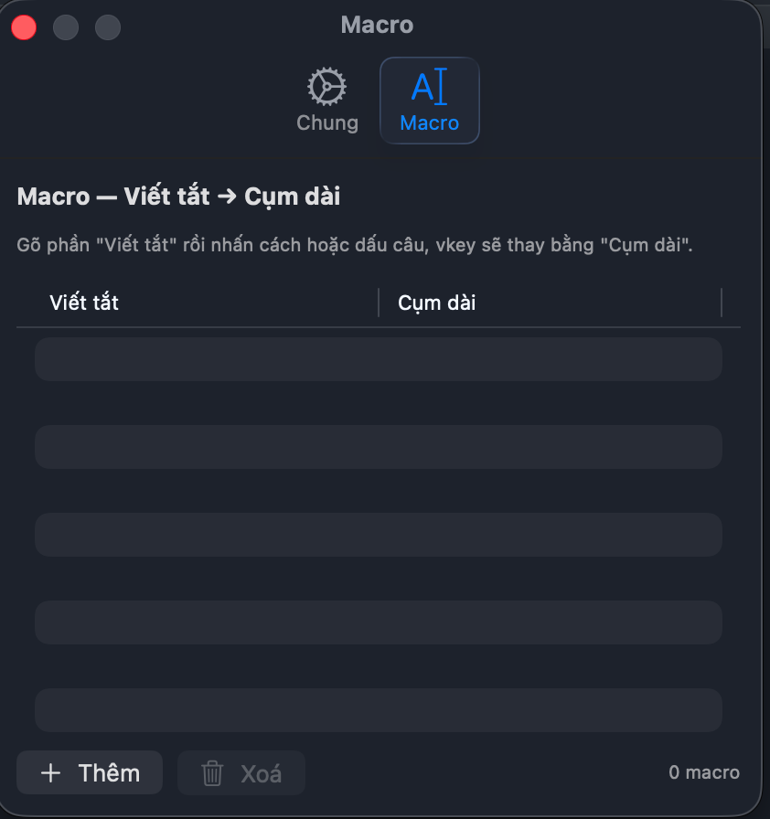

# vkey

Bộ gõ tiếng Việt cá nhân, đơn giản, cho macOS. Viết bằng Swift native, chạy như một app menu bar nhỏ gọn, hỗ trợ macOS 14 Sonoma trở lên.


> **vkey là một bản fork mở rộng từ [Caffee](https://github.com/khanhicetea/Caffee)** của tác giả Khanh Nguyen ([@khanhicetea](https://github.com/khanhicetea)). Toàn bộ engine xử lý âm tiết tiếng Việt (Telex / VNI / Parser / Transformer / Validator) cùng kiến trúc Platform-Layer ban đầu đều do tác giả gốc xây dựng. vkey kế thừa nguyên si và bổ sung thêm các tính năng riêng (xem mục [Khác biệt so với Caffee](#khác-biệt-so-với-caffee)).

---

## Chức năng

- ✅ Gõ tiếng Việt với 2 kiểu phổ biến: **Telex** và **VNI**.
- ✅ Tuỳ chọn kiểu đặt dấu: **Kiểu mới** (thủy, khỏe) hoặc **Kiểu cũ** (thuỷ, khoẻ).
- ✅ **Tự động sửa lỗi gõ nhầm (Auto Typo Correction)**: Tự động sửa khi gõ nhầm dấu thanh sớm hoặc sai vị trí (ví dụ: `thfi` -> `thì`, `thfis` -> `thí`, `th2i` -> `thì`, `th1i` -> `thí`), sửa gạch chữ đ cuối từ (ví dụ: `dinhjd` -> `định` / `dinh59` -> `định`), sửa lỗi hoán đổi nguyên âm (ví dụ: `veeitj` -> `việt`) và hoán đổi phụ âm cuối (ví dụ: `phuowgn` -> `phương`). Có thể bật/tắt dễ dàng trong Cài đặt.
- ✅ Bộ gõ chỉ duy nhất Unicode (UTF-8), không hỗ trợ TCVN3/VNI Windows (giữ đơn giản).
- ✅ Nhớ chế độ Vi/En theo từng ứng dụng (per-app input mode memory).
- ✅ **Smart Switch**: tự động tắt khi vào các bảng nhập liệu dạng Overlay/Launcher (Spotlight, Raycast, Alfred, LaunchBar) nhờ cơ chế AX Overlay Probing siêu nhẹ (<0.1ms) — giúp bạn gõ tìm kiếm tiếng Anh thuận tiện, không bị transform. Tự động khôi phục hoàn hảo trạng thái bộ gõ của ứng dụng nền trước đó khi đóng bảng nhập liệu overlay lại. Có thể kích hoạt hoặc tắt nhanh chóng thông qua toggle trực tiếp ngay trên thanh Menu Bar.
- ✅ **Bộ lọc phụ âm không hợp lệ (Impossible Consonant Clusters Filter)**: Bổ sung bộ lọc phụ âm đầu không hợp lệ trong Tiếng Việt tại tầng xử lý phím đầu tiên. Nếu phát hiện từ bắt đầu bằng các tổ hợp không có trong Tiếng Việt (`str`, `pl`, `cl`, `fl`, `gl`, `bl`, `br`, `cr`, `dr`, `fr`, `gr`, `pr`, `wr`, `st`, `sm`, `sn`, `sp`, `sc`, `sk`, `sw`, `tw`, `dw`, `sh`, `ps`, `pn`, `ts`, `kn`, `kr`), bộ gõ sẽ lập tức bỏ qua xử lý và trả về ký tự gốc ngay lập tức, tự động re-arm khi người dùng nhấn Backspace xoá qua ký tự lỗi.
- ✅ **Hiển thị thông báo trực quan (Translucent Toggle HUD)**: Cửa sổ thông báo mờ kính (Glassmorphic HUD) hiển thị giữa màn hình khi chuyển đổi chế độ gõ (VI/EN) qua phím tắt, giúp nhận biết trạng thái gõ tức thời mà không cần nhìn lên Menu Bar. Tự động thông minh bỏ qua khi khởi động và Smart Switch.
- ✅ **Macro** (viết tắt → cụm dài): gõ `vn ` → ra `Việt Nam `.
- ✅ Phím tắt linh hoạt: hỗ trợ cả tổ hợp key+modifier (vd `⌃⇧Z`) và **modifier-only** (vd nhấn-thả `⌃⇧` để toggle).
- ✅ Fix lỗi thanh địa chỉ trình duyệt + Excel autocomplete.
- ✅ Tương thích Electron / web app (Claude desktop, Notion, Slack, Discord…): mặc định dùng hybrid sending strategy, tự fallback step-by-step nếu phát hiện thất bại.
- ✅ Tự bypass khi macOS bật secure input (gõ password an toàn).
- ✅ Khởi động cùng macOS (tuỳ chọn).
- ✅ Hoạt động xuyên QWERTZ / AZERTY / Dvorak (dùng physical key code → mapping QWERTY position cho Telex/VNI).
- ✅ **Cập nhật trực tiếp (Sparkle Integration)**: Tải và cài đặt trực tiếp bản cập nhật mới nhanh gọn, an toàn.
- ✅ Hỗ trợ **Ủng hộ tác giả** (Donate) qua VietQR.

## Hình ảnh giao diện

<p align="center">
  
  
  
</p>

## Khác biệt so với Caffee

| Hạng mục | Caffee | vkey |
|----------|--------|------|
| Engine gõ (Telex/VNI/Parser/Transformer) | ✅ Tác giả gốc | Kế thừa nguyên si |
| Per-app mode memory | ✅ | Kế thừa |
| Autocomplete fix (browser/Excel) | ✅ | Kế thừa |
| App icon, menu bar icon | hạt cà phê | **Mới**: nền đỏ + chữ "Vkey", cờ VN/US trên menu bar chuẩn kích thước |
| Phím tắt | Option+Z (key+modifier) | **Mới**: modifier-only `⌃⇧` mặc định + custom recorder chấp nhận mọi tổ hợp |
| Smart Switch (Spotlight/Raycast/Alfred) | ❌ | **Mới**: Tích hợp cơ chế AX Overlay Probing siêu nhẹ (<0.1ms) tự động phát hiện overlay panel và khôi phục hoàn hảo trạng thái ứng dụng nền trước đó |
| Bộ lọc phụ âm không hợp lệ (Phonetic Bypass) | ❌ | **Mới**: Tự động bỏ qua gõ tiếng Việt ngay từ phím đầu tiên khi gõ các tổ hợp phụ âm không có trong Tiếng Việt (như `str`, `pl`, `cl`), tự động re-arm khi Backspace |
| Hiển thị thông báo chuyển đổi (HUD) | ❌ | **Mới**: Cửa sổ HUD mờ kính (.ultraThinMaterial) cao cấp hiển thị giữa màn hình |
| Macro (text expansion) | TODO trong code | **Mới**, hoàn thiện |
| Tuỳ chọn kiểu đặt dấu (Cũ/Mới) | ❌ (Chỉ Kiểu cũ) | **Mới**: Tuỳ chọn linh hoạt trong Cài đặt |
| Tương thích Electron/web app | mặc định batch | **Mới**: mặc định hybrid + auto-fallback step-by-step |
| Cập nhật tự động (Sparkle) | ❌ | **Mới**: Tải & cài đặt trực tiếp không cần mở trình duyệt nhờ framework Sparkle |
| DMG packaging script | thủ công | **Mới**: script Swift sinh asset + DMG build pipeline |
| Tests | bộ test engine | Kế thừa + thêm tests cho WordBuffer / KeyboardUS / Validator |

## Cài đặt

### Tải file DMG (đơn giản nhất)

1. Tải `vkey-x.y.z.dmg` từ trang [Releases](../../releases/latest).
2. Mở DMG → kéo `vkey` vào thư mục `Applications`.
3. Vì vkey chỉ ký ad-hoc (không có Apple Developer ID), khi mở lần đầu macOS chặn:
   - Mở Finder → Applications → **click chuột phải vào vkey** → chọn **"Mở"**.
   - Hộp thoại hiện ra → bấm **"Mở"** xác nhận.
   - Chỉ cần làm 1 lần.
4. Vào **System Settings → Privacy & Security → Accessibility** → bật toggle cho `vkey`.
5. Tắt rồi mở lại app để event tap được nạp.

### Build từ source

Yêu cầu: macOS 14+, Xcode 16+ (Swift 5+).

```bash
git clone https://github.com/tuanlongsav/vkey.git
cd vkey
xcodebuild -project vkey.xcodeproj -scheme vkey \
  -configuration Release \
  -derivedDataPath /tmp/vkey-release \
  CODE_SIGN_IDENTITY="-" CODE_SIGNING_REQUIRED=NO \
  clean build
ditto /tmp/vkey-release/Build/Products/Release/vkey.app /Applications/vkey.app
```

## Sử dụng

| Tác vụ | Cách dùng |
|--------|----------|
| Chuyển VN ↔ EN | Nhấn + nhả **⌃⇧** (Control + Shift) đồng thời |
| Đổi phím tắt | Menu vkey → Cài đặt → Phím tắt → bấm vào nút và nhập tổ hợp mới |
| Bật/tắt thông báo HUD | Menu → Cài đặt → tab Chung → "Hiển thị thông báo khi chuyển VI/EN" |
| Bật/tắt từ menu | Click cờ trên menu bar → "Chuyển đổi bộ gõ 🇻🇳 \| 🇺🇸" |
| Đổi kiểu gõ | Menu → "Kiểu Telex" / "Kiểu VNI" |
| Đổi kiểu đặt dấu | Menu → Cài đặt → Chung → "Kiểu đặt dấu" (mới/cũ) |
| Thêm macro | Menu → Cài đặt → tab Macro → bấm "Thêm" |
| Ủng hộ tác giả | Menu → "Ủng hộ tác giả" (Quét mã VietQR) |
| Kiểm tra cập nhật | Menu → "Kiểm tra cập nhật" |

**Trạng thái icon menu bar:**
- 🇻🇳 cờ Việt Nam: đang gõ tiếng Việt
- 🇺🇸 cờ Mỹ: đang gõ tiếng Anh
- 🔒 ổ khoá: đang ở ô password (vkey tự bypass)
- ⚙️ bánh răng có dấu hỏi: chưa cấp quyền Accessibility

## FAQ

**1. Có an toàn không?**
Mã nguồn mở GPL v3, bạn tự build hoặc đọc code trước khi tin. App không gửi dữ liệu đi đâu, không telemetry.

**2. Tại sao phải cấp quyền Accessibility?**
vkey nghe keyboard system-wide (qua `CGEvent.tapCreate`) để chuyển ký tự bạn gõ thành tiếng Việt. Đây là quyền chuẩn cho mọi bộ gõ "hàng chế" trên macOS (OpenKey, EVKey, GoTiengViet cũng vậy). Apple's official IME thì dùng cơ chế khác (Input Method Kit) nhưng có nhược điểm gạch chân + bug khi click sang ô khác giữa từ.

**3. Sao chỉ nhận Telex và VNI?**
Triết lý "đơn giản nhất". Hai kiểu này phủ ~95% người dùng VN. Không có bảng setting to đùng như OpenKey/EVKey.

**4. Bản DMG có notarized không?**
Không. Đây là dự án cá nhân, không có Apple Developer ID. Bạn tin tưởng → right-click Open. Không tin → build lại từ source.

## Giấy phép & Bản quyền

vkey kế thừa giấy phép **GNU General Public License v3.0** từ Caffee. Xem file [`LICENSE`](LICENSE).

Điều này có nghĩa:
- Bạn **được** sao chép, sửa, phân phối lại.
- Bản phân phối lại của bạn **bắt buộc** cũng phải mở mã nguồn dưới GPL v3 (copyleft).
- Không được phép đóng nguồn và bán thương mại độc quyền.

### Ghi công (Credit & Attribution)

vkey là một sản phẩm nguồn mở phát triển vì cộng đồng, kế thừa và học hỏi các giải pháp xuất sắc từ các tác giả đi trước:
- **[Caffee](https://github.com/khanhicetea/Caffee)** © Khanh Nguyen ([@khanhicetea](https://github.com/khanhicetea)) — Đóng góp toàn bộ engine xử lý tiếng Việt ban đầu + kiến trúc lõi của bộ gõ.
- **[XKey](https://github.com/xmannv/xkey)** © Xuan Manh Nguyen ([@xmannv](https://github.com/xmannv)) — Đóng góp các ý tưởng sáng tạo và giải pháp kỹ thuật xuất sắc bao gồm:
  - Thiết kế và giải pháp giao diện **Translucent Toggle HUD** mờ kính (tích hợp tại `vkey/Platform/ToggleHUDWindow.swift`).
  - Giải pháp tối ưu hóa **Smart Switch với bộ quét AX Probing** phát hiện overlay và khôi phục trạng thái bộ gõ của ứng dụng nền (tích hợp tại `vkey/Platform/Focused.swift` và `vkey/Platform/EventHook.swift`).
  - Giải pháp bộ lọc **Impossible Consonant Clusters** (bộ lọc phụ âm không hợp lệ) giúp tự động bypass gõ tiếng Anh nhanh xen kẽ (tích hợp tại `vkey/App/InputProcessor.swift`).
- **vkey** © 2026 longht ([@tuanlongsav](https://github.com/tuanlongsav)) — các tính năng mở rộng nêu trong bảng [Khác biệt so với Caffee](#khác-biệt-so-với-caffee).

Mỗi file source vẫn giữ header gốc của tác giả Caffee khi có. Vui lòng tôn trọng attribution khi tiếp tục fork.

### Lưu ý về tên gọi

Tên "vkey" được chọn ngắn gọn, **không liên quan** đến các sản phẩm thương mại / dịch vụ đã đăng ký bảo hộ tại Việt Nam (vd các sản phẩm chữ ký số / bảo mật có chữ "VKey"). Đây là phần mềm phi thương mại, không thay thế / cạnh tranh với sản phẩm đăng ký thương hiệu nào.

### Engine xử lý tiếng Việt

vkey **không** sử dụng mã nguồn từ UniKey (Phạm Kim Long), EVKey hay OpenKey. Engine `Engine/TiengViet*.swift` là của Caffee, được viết lại độc lập từ đầu bằng Swift theo lý thuyết âm tiết học tiếng Việt — xem chi tiết trong [app-arch.md](app-arch.md).
